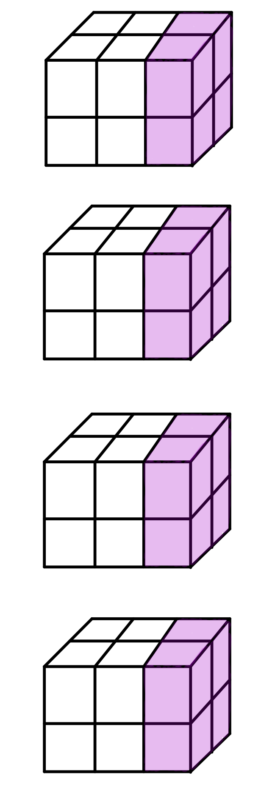

# Pytorch-BN层

## BN解决了Internal Covariate Shift问题

机器学习领域有个很重要的假设：**独立同分布假设，即假设训练数据和测试数据是满足相同分布的**。我们知道：神经网络的训练实际上就是在拟合训练数据的分布。如果不满足独立同分布假设，那么训练得到的模型的泛化能力肯定不好。

再来思考一个问题：**为什么传统的神经网络要求将数据归一化(训练阶段将训练数据归一化并记录均值和方差，测试阶段利用记录的均值和方差将测试数据也归一化)**？

首先：做了归一化之后，可以近似的认为训练数据和测试数据满足相同分布(即均值为0，方差为1的标准正态)，这样一来模型的泛化能力会得到提高。其次：如果不做归一化，使用mini-batch梯度下降法训练的时候，每批训练数据的分布不相同，那么网络就要在每次迭代的时候去适应不同的分布，这样会大大降低网络的训练速度。综合以上两点，所以需要对数据做归一化预处理。PS：如果是mini-batch梯度下降法，每个batch都可以计算出一个均值和方差，最终记录的均值和方差是所有batches均值和方差的期望，当然也有其它更复杂的记录方式，如pytorch使用的滑动平均。

**Internal Covariate Shift**问题：在训练的过程中，即使对输入层做了归一化处理使其变成标准正态，随着网络的加深，函数变换越来越复杂，许多隐含层的分布还是会彻底放飞自我，变成各种奇奇怪怪的正态分布，并且整体分布逐渐往非线性函数(也就是激活函数)的取值区间的上下限两端靠近。对于sigmoid函数来说，就意味着输入值是大的负数或正数，这导致反向传播时底层神经网络的梯度消失，这是训练深层神经网络收敛越来越慢的本质原因。

为了解决上述问题，又想到网络的某个隐含层相对于之后的网络就相当于输入层，所以BN的基本思想就是：**把网络的每个隐含层的分布都归一化到标准正态**。其实就是把越来越偏的分布强制拉回到比较标准的分布，这样使得激活函数的输入值落在该激活函数对输入比较敏感的区域，这样一来输入的微小变化就会导致损失函数较大的变化。通过这样的方式可以使梯度变大，就避免了梯度消失的问题，而且梯度变大意味着收敛速度快，能大大加快训练速度。

简单说来就是：传统的神经网络只要求第一个输入层归一化，而带BN的神经网络则是把每个输入层（把隐含层也理解成输入层）都归一化。

## BN的具体步骤

BN实际上包含两步操作。$x_i$是BN的输入，$y_i$是BN的输出。

- 归一化到标准正态，$\epsilon$是一个非常小的数字，是为了防止除以0

$$
\mu=\frac{1}{m}\sum\limits_{i=1}^{m}x_i
$$
$$
\sigma^2=\frac{1}{m}\sum\limits_{i=1}^{m}(x_i-\mu)^2
$$
$$
\hat{x}_i\larr\frac{x_i-\mu}{\sqrt{\sigma^2+\epsilon}}
$$

以sigmoid函数为例，可以将其近似的看成两个部分，中间区域的线性部分以及两侧的非线性部分。Internal Covariate Shift问题就是：隐含层的输出都落在了sigmoid函数的非线性区域，这部分区域对损失函数的影响极小，所以梯度也极小。归一化操作就是把非线性区域的值拉回到线性区域，这样一来虽然增大了梯度，但也降低了数据的非线性表示能力。所以还需要缩放操作来弥补归一化操作降低的非线性表达能力。归一化从形式上看来就是把输入值减去一个数字，再除以一个数字。它的逆操作就是先乘以一个数字，在加上一个数字，这就是缩放。

- 缩放

$$
y_i\larr\gamma\hat{x_i}+\beta\equiv BN_{\gamma,\beta}(x_i)
$$

## Pytorch中的BN

Pytorch中的BN操作为`nn.BatchNorm2d(self, num_features, eps=1e-5, momentum=0.1, affine=True, track_running_stats=True)`

- num_features，输入数据的通道数，归一化时需要的均值和方差是在每个通道中计算的
- eps，用来防止归一化时除以0
- momentum，滑动平均的参数，用来计算running_mean和running_var
- affine，是否进行仿射变换，即缩放操作
- track_running_stats，是否记录训练阶段的均值和方差，即running_mean和running_var

BN层的状态包含五个参数:

- weight，缩放操作的$\gamma$。
- bias，缩放操作的$\beta$。
- running_mean，训练阶段统计的均值，测试阶段会用到。
- running_var，训练阶段统计的方差，测试阶段会用到。
- num_batches_tracked，训练阶段的batch的数目，如果没有指定momentum，则用它来计算running_mean和running_var。一般momentum默认值为0.1，所以这个属性暂时没用。

weight和bias这两个参数需要训练，而running_mean、running_val和num_batches_tracked不需要训练，它们只是训练阶段的统计值。

在训练阶段，假设输入是[4, 3, 2, 2]的张量，如下图所示。



对于这四个数据块，每次取其中一个通道的数据，然后对这个16个数据求均值$\mu$和方差$\sigma$，并用求得的均值和方差归一化并缩放数据，得到BN层的输出

接下来用滑动平均公式来更新running_mean和running_var，momentum默认值为0.1。

$$
running\_mean = (1 - momentum) * running\_mean + momentum * \mu \\
running\_var = (1 - momentum) * running\_var + momentum * \sigma
$$

在测试阶段，归一化操作不用再计算均值方差，而是直接使用训练阶段统计的running_mean和running_var。

**Note**: track_running_stats和self.training有四种可能的组合。

- training=True, track_running_stats=True, 这是常见的训练时期待的行为，running_mean和running_var会跟踪不同batch数据的均值和方差，但是仍然用每个batch的均值和方差做归一化。
- training=True, track_running_stats=False, 这时候running_mean和running_var不跟踪各个batch的均值和方差了，但仍然用每个batch的均值和方差做归一化。
- training=False, track_running_stats=True, 这是常见的测试时期待的行为，即使用训练阶段统计的running_mean和running_var做归一化。
- training=False, track_running_stats=False, 使用每个batch的均值和方差做归一化。

## Pytorch代码示例

```python
bn = nn.BatchNorm2d(3)
x = torch.randn(4, 3, 2, 2)
y = bn(x)
a = (x[0, 0, :, :] + x[1, 0, :, :] + x[2, 0, :, :] + x[3, 0, :, :]).sum() / 16
b = (x[0, 1, :, :] + x[1, 1, :, :] + x[2, 1, :, :] + x[3, 1, :, :]).sum() / 16
c = (x[0, 2, :, :] + x[1, 2, :, :] + x[2, 2, :, :] + x[3, 2, :, :]).sum() / 16
print('The mean value of the first channel is %f' % a.data)
print('The mean value of the first channel is %f' % b.data)
print('The mean value of the first channel is %f' % c.data)
print('The output mean value of the BN layer is %f, %f, %f' % (bn.running_mean.data[0], bn.running_mean.data[1], bn.running_mean.data[2]))
```

细心的读者可能已经发现第一个通道的running_mean正好是真实的mean的0.1倍，这是为什么呢？因为在最开始的时候running_mean=0，然后用滑动平均公式去更新：
$$
running_mean = 0.9 * running_mean + 0.1 * mean = 0.1 * mean
$$

那么当我们前向传播两次之后，再来观察running_mean和mean的关系。

```python
bn = nn.BatchNorm2d(3)
x = torch.randn(4, 3, 2, 2)
y = bn(x)
y = bn(x)  # 前向传播两次
a = (x[0, 0, :, :] + x[1, 0, :, :] + x[2, 0, :, :] + x[3, 0, :, :]).sum() / 16
b = (x[0, 1, :, :] + x[1, 1, :, :] + x[2, 1, :, :] + x[3, 1, :, :]).sum() / 16
c = (x[0, 2, :, :] + x[1, 2, :, :] + x[2, 2, :, :] + x[3, 2, :, :]).sum() / 16
print('The mean value of the first channel is %f' % a.data)
print('The mean value of the first channel is %f' % b.data)
print('The mean value of the first channel is %f' % c.data)
print('The output mean value of the BN layer is %f, %f, %f' % (bn.running_mean.data[0], bn.running_mean.data[1], bn.running_mean.data[2]))
```

我们会发现它们存在着这样一个关系：
$$
running_mean = 0.9 * (0.9 * 0 + 0.1 * mean) + 0.1 * mean = 0.19 * mean
$$
