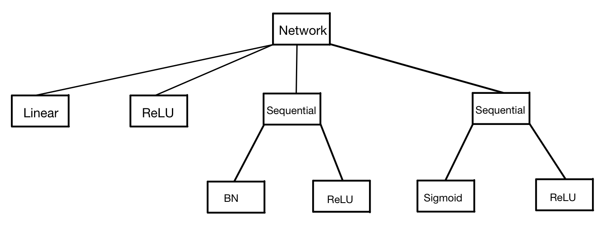

# Pytorch-如何查看网络的模块和参数

在实验的过程中，我们经常需要知道当前网络由哪些模块组成，以及这些模块当前的参数是什么。

## 查看模块

以如下网络为例：

```python
m = nn.Sequential(nn.Linear(2, 2),
                  nn.ReLU(),
                  nn.Sequential(nn.BatchNorm2d(2), nn.ReLU()),
                  nn.Sequential(nn.Sigmoid(), nn.ReLU()))
```



### children()

只展示网络的子节点。

```python
print(list(m.children()))

[Linear(in_features=2, out_features=2, bias=True),
 ReLU(),
 Sequential(
  (0): BatchNorm2d(2, eps=1e-05, momentum=0.1, affine=True, track_running_stats=True)
  (1): ReLU()
),
 Sequential(
  (0): Sigmoid()
  (1): ReLU()
)]
```

### named_children()

给`children()`的输出加上了编号。

```python
print(list(m.named_children()))

[('0', Linear(in_features=2, out_features=2, bias=True)),
 ('1', ReLU()),
 ('2',
  Sequential(
  (0): BatchNorm2d(2, eps=1e-05, momentum=0.1, affine=True, track_running_stats=True)
  (1): ReLU()
)),
 ('3', Sequential(
  (0): Sigmoid()
  (1): ReLU()
))]
```

### modules()

以前序dfs遍历并输出这颗树。

```python
print(list(m.modules()))

[Sequential(
  (0): Linear(in_features=2, out_features=2, bias=True)
  (1): ReLU()
  (2): Sequential(
    (0): BatchNorm2d(2, eps=1e-05, momentum=0.1, affine=True, track_running_stats=True)
    (1): ReLU()
  )
  (3): Sequential(
    (0): Sigmoid()
    (1): ReLU()
  )
),
 Linear(in_features=2, out_features=2, bias=True),
 ReLU(),
 Sequential(
  (0): BatchNorm2d(2, eps=1e-05, momentum=0.1, affine=True, track_running_stats=True)
  (1): ReLU()
),
 BatchNorm2d(2, eps=1e-05, momentum=0.1, affine=True, track_running_stats=True),
 ReLU(),
 Sequential(
  (0): Sigmoid()
  (1): ReLU()
),
 Sigmoid(),
 ReLU()]
```

### named_modules()

给`modules()`的输出加上了编号。

```python
print(list(m.named_modules()))

[('',
  Sequential(
  (0): Linear(in_features=2, out_features=2, bias=True)
  (1): ReLU()
  (2): Sequential(
    (0): BatchNorm2d(2, eps=1e-05, momentum=0.1, affine=True, track_running_stats=True)
    (1): ReLU()
  )
  (3): Sequential(
    (0): Sigmoid()
    (1): ReLU()
  )
)),
 ('0', Linear(in_features=2, out_features=2, bias=True)),
 ('1', ReLU()),
 ('2',
  Sequential(
  (0): BatchNorm2d(2, eps=1e-05, momentum=0.1, affine=True, track_running_stats=True)
  (1): ReLU()
)),
 ('2.0',
  BatchNorm2d(2, eps=1e-05, momentum=0.1, affine=True, track_running_stats=True)),
 ('2.1', ReLU()),
 ('3', Sequential(
  (0): Sigmoid()
  (1): ReLU()
)),
 ('3.0', Sigmoid()),
 ('3.1', ReLU())]
```

## 查看参数

以BN层为例。`m = nn.BatchNorm2d(2)`

### state_dict()

查看一个网络所有的参数。

```python
print(m.state_dict().keys())

odict_keys(['weight', 'bias', 'running_mean', 'running_var', 'num_batches_tracked'])
```

### parameters()和named_parameters()

查看网络中需要更新的参数。parameters()只显示参数，named_parameters还显示参数的名称。

```python
for k, v in m.named_parameters():
    print(k)
    print(v)

weight
Parameter containing:
tensor([1., 1.], requires_grad=True)
bias
Parameter containing:
tensor([0., 0.], requires_grad=True)

for v in m.parameters():
    print(v)

Parameter containing:
tensor([1., 1.], requires_grad=True)
Parameter containing:
tensor([0., 0.], requires_grad=True)
```

### buffers()和named_buffers()

查看网络中不需要更新的参数，如BN层中的running_mean, running_var和num_batches_tracked。

一个模块中不需要更新的参数有两种：

- 普通的类成员变量，形如`self.xxx`
- buffer变量，需要调用`self.register_buffer()`方法将一个变量注册成buffer变量。

buffer变量存在的意义就在于: m.cuda()的时候，会自动把所有的parameters和buffers也移动到GPU上，而普通的类成员变量仍然存在于CPU中。

```python
for k, v in m.named_buffers():
    print(k)
    print(v)

running_mean
tensor([0., 0.])
running_var
tensor([1., 1.])
num_batches_tracked
tensor(0)

for v in m.buffers():
    print(v)

tensor([0., 0.])
tensor([1., 1.])
tensor(0)
```
