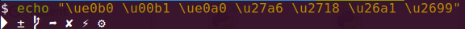

# 1.简介

shell的类型有很多种，linux下默认的是bash，虽然bash的功能已经很强大，但对于以懒惰为美德的程序员来说，bash的提示功能不够强大，界面也不够炫，并非理想工具。

而zsh的功能极其强大，只是配置过于复杂，起初只有极客才在用。后来，有个穷极无聊的程序员可能是实在看不下去广大猿友一直只能使用单调的bash, 于是他创建了一个名为`oh-my-zsh`的开源项目。


自此，只需要简单的安装配置，程序员们都可以用上高档大气上档次的`oh my zsh`了。

# 2.安装zsh

```
# 安装zsh
sudo apt install zsh

# 将默认的shell设置成zsh
chsh -s /bin/zsh
```

然后重启电脑，再打开的时候就看到zsh啦。

# 3.安装oh-my-zsh

## 3.1安装

```
wget https://github.com/robbyrussell/oh-my-zsh/raw/master/tools/install.sh -O - | sh
```

成功界面

```
  ____  / /_     ____ ___  __  __   ____  _____/ /_  
 / __ \/ __ \   / __ `__ \/ / / /  /_  / / ___/ __ \ 
/ /_/ / / / /  / / / / / / /_/ /    / /_(__  ) / / / 
\____/_/ /_/  /_/ /_/ /_/\__, /    /___/____/_/ /_/  
                        /____/                       ....is now installed!
Please look over the ~/.zshrc file to select plugins, themes, and options.

p.s. Follow us at https://twitter.com/ohmyzsh.

p.p.s. Get stickers and t-shirts at http://shop.planetargon.com.
```

## 3.2主题配置

我使用的是很热门的`powerlevel9k`主题。

下载主题

```
git clone https://github.com/bhilburn/powerlevel9k.git ~/.oh-my-zsh/custom/themes/powerlevel9k
```

修改配置文件

```
vim ~/.zshrc
```

将`ZSH_THEME`改成`powerlevel9k/powerlevel9k`

```
ZSH_THEME="powerlevel9k/powerlevel9k"
```

更新配置

```
source ~/.zshrc 
```

可能会出现乱码的问题。原因是`powerlevel9k`使用了很多特殊符号，而一般字体又不支持这些符号，所以就出现了乱码。需要下载`powerline`字体

```
sudo apt-get install fonts-powerline
```

测试powerline字体

```
echo "\ue0b0 \u00b1 \ue0a0 \u27a6 \u2718 \u26a1 \u2699"
```



如果显示了特殊符号，主题就可以正常工作了。

## 3.3插件

### 3.3.1autojump目录跳转插件

```
sudo apt install autojump
```

然后在`.zshrc`中添加autojump插件

```
plugins=(git autojump)
```

### 3.3.2autosuggestion命令提示插件

```
git clone https://github.com/zsh-users/zsh-autosuggestions ${ZSH_CUSTOM:-~/.oh-my-zsh/custom}/plugins/zsh-autosuggestions
```

然后在`.zshrc`中添加autosuggestion插件

```
plugins=(git zsh-autosuggestions autojump)
```

### 3.3.3syntax-highlighting语法高亮插件

```
git clone https://github.com/zsh-users/zsh-syntax-highlighting.git ${ZSH_CUSTOM:-~/.oh-my-zsh/custom}/plugins/zsh-syntax-highlighting
```

然后在`.zshrc`中添加syntax-highlighting插件，需要注意的是syntax-highlighting需要在最后面。

```
plugins=(git zsh-autosuggestions autojump zsh-syntax-highlighting)
```

**注意**：做完了一切操作之后，一定要`source ~/.zshrc`，否则不会显示效果。

# 4.使用技巧

## 4.1目录跳转

`d`显示最近访问目录的编号，然后直接输入编号就可以访问对应的目录了。

`j+目录名`可以直接跳转到对应的目录(autojump插件)。目录名可以简写。如果是从未访问过得目录不可以使用这个功能。

## 4.2命令提示

输入命令的时候，会自动有命令提示(autosuggestion插件)。`ctrl+f`或上方向键采纳提供的建议。

## 4.3命令补全

输入命令的时候，按下`tab`会有命令提示，再按一次`tab`可以进入选择模式。

选择模式下，`ctrl+n/p/f/b`可以实现上下左右移动(n=next，p=previous，f=forward，b=backward)，也可以使用上下左右方向键。